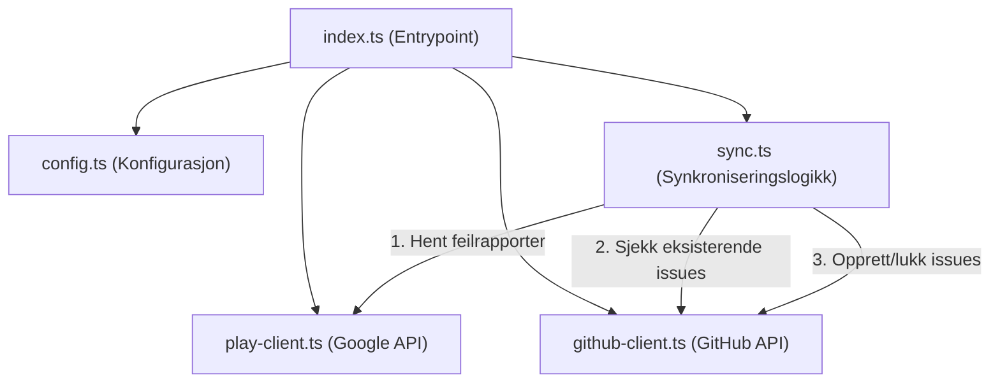

# Teknisk Tilstandsanalyse: Android Vitals → GitHub Issues

Dette dokumentet inneholder en grundig arkitektonisk og teknisk gjennomgang av repositoriet. Det evaluerer kildekodens struktur, ytelse, typesikkerhet og robuste egenskaper, samt presenterer konkrete forslag til forbedringer og en implementeringsplan.

---

## 1. Arkitektonisk Oversikt

Applikasjonen er bygget som en GitHub Action i TypeScript (Node.js 24) og kompileres to ESM ved hjelp av `@vercel/ncc`. 

### Komponentstruktur og Dataflyt
Kildekoden har en sunn og ryddig ansvarsfordeling (Separation of Concerns). Under er en visualisering av hvordan komponentene samhandler:



* **[index.ts](../src/index.ts):** Fungerer som applikasjonens orkestrator. Den henter konfigurasjon, initialiserer klientene, og løper gjennom pakkenavnene som skal overvåkes.
* **[config.ts](../src/config.ts):** Håndterer innlesing og validering av input-parametere fra GitHub Actions-miljøet.
* **[play-client.ts](../src/play-client.ts):** Kapsler inn integrasjonen mot Google Play Developer Reporting API.
* **[github-client.ts](../src/github-client.ts):** Kapsler inn integrasjonen mot GitHubs API via `@actions/github` (Octokit).
* **[sync.ts](../src/sync.ts):** Inneholder selve forretningslogikken for synkronisering (sammenligne Play Console med GitHub Issues, deduplisering og lukking av løste problemer).
* **[types.ts](../src/types.ts):** Felles grensesnitt (interfaces) for konfigurasjon og datamodeller.

---

## 2. Tekniske Styrker

> [!NOTE]
> Prosjektet har et meget solid fundament. Følgende aspekter er forbilledlig løst:

* **Moderne Stack:** Koden bruker TypeScript 6.x, Node 24, og Vitest som test-runner. Dette er helt i front av moderne Node.js-utvikling.
* **Tydelig ansvarsfordeling:** Ingen filer er unødvendig store eller komplekse. Dette gjør koden lettlest og enkel å vedlikeholde.
* **Automatisert CI/CD:** Bruken av GitHub Actions for linting, testing, og automatisk oppdatering av `dist/` sikrer høy kodekvalitet over tid.
* **Vitest Mocks:** Testene er raske og isolerte takket være god bruk av Vitest-mocking av API-klientene.

---

## 3. Identifiserte Forbedringsområder (Teknisk Gjeld)

Selv om koden er ryddig, er det flere områder som kan optimaliseres for produksjonsskala, spesielt med tanke på API-hastighetsbegrensninger (Rate Limits) og robusthet.

### A. Overflødige API-kall ved sjekk av Labels (Høy Prioritet)
I [sync.ts](../src/sync.ts#L35-L38) kjøres det sjekker for labels for hver eneste feil som skal opprettes:
```typescript
await githubClient.ensureLabel(dedupeLabel, "ededed");
for (const label of config.extraLabels) {
  await githubClient.ensureLabel(label);
}
```
Hvert kall til `ensureLabel` gjør et API-kall for å hente labelen (`getLabel`), og hvis den ikke finnes (404), et nytt kall for å opprette den (`createLabel`). 
* **Konsekvens:** Hvis en app har 50 krasjrapporter og 3 felles labels, kan dette resultere i over 150 API-kall til GitHub kun for å verifisere labels. Dette kan føre til at actionen blir rate-limited av GitHub.

### B. Mangel på Typesikkerhet (`any` i eksterne klienter) (Medium Prioritet)
Flere steder i koden er det brukt `any` for objekter som kommer fra eksterne biblioteker:
* I [types.ts](../src/types.ts#L2): `serviceAccountJson: any;`
* I [github-client.ts](../src/github-client.ts#L6): `private octokit: any;`
* I [play-client.ts](../src/play-client.ts#L6-L7): `private auth: any;` og `private reporting: any;`
* **Konsekvens:** Man mister fordelene med IntelliSense og statisk analyse for disse kritiske API-objektene. Endringer i eksterne biblioteker vil ikke fanges opp av TypeScript-kompilatoren.

### C. Hardkodet Språk og Manglende Fleksibilitet (Medium Prioritet)
Malene for lukking og opprettelse av issues er delvis hardkodet på norsk og engelsk:
* Tittel og tabellinnhold er på norsk: `"Årsak"`, `"Berørte brukere"`, etc.
* Kommentaren ved lukking i [sync.ts](../src/sync.ts#L48) er hardkodet: `"Dette problemet er markert som løst i Google Play Console. Lukker issue."`
* **Konsekvens:** Actionen er mindre egnet for internasjonale team eller prosjekter som ønsker engelsk eller tilpasset tekst på sine issues.

### D. Ingen Retry-logikk for API-kall (Medium Prioritet)
Nettverkskall mot Google Play Console og GitHub API kjøres uten noen form for retries ved midlertidige feil (transient errors) eller rate limiting.
* **Konsekvens:** Dersom en av tjenestene har et kortvarig avbrudd eller returnerer en 503/429, vil hele synkroniseringen feile umiddelbart.

### E. Testdekning av API-Mapping (Lav Prioritet)
[play-client.ts](../src/play-client.ts#L42-L59) inneholder en viktig oversettelse fra Googles rå-API-svar til vår interne `ErrorIssue`-type. Denne mappingen er ikke testet med faktiske JSON-fixtures, kun mock-funksjoner.

---

## 4. Konkret Handlingsplan

Vi foreslår å dele forbedringene inn i fire faser for å sikre en kontrollert og testbar utvikling.

### Fase 1: Ytelsesoptimalisering (Caching av Labels)
* **Mål:** Redusere antall API-kall mot GitHub dramatisk.
* **Tiltak:**
  1. Hent alle eksisterende labels i repositoriet i ett enkelt API-kall (`listLabelsForRepo`) ved oppstart av `GitHubClient`.
  2. Lagre disse i et lokalt `Set<string>` i minnet.
  3. Endre `ensureLabel` til å sjekke mot dette settet. Gjør kun `createLabel` dersom labelen ikke finnes i settet, og oppdater settet etter opprettelse.

### Fase 2: Forbedret Typesikkerhet
* **Mål:** Fjerne `any` og sikre full TypeScript-støtte.
* **Tiltak:**
  1. Installer type-definisjoner for Octokit om nødvendig, eller bruk `ReturnType<typeof github.getOctokit>` for `octokit`-feltet.
  2. Importer og bruk korrekte typer fra `@googleapis/playdeveloperreporting` og `google-auth-library`.
  3. Definer et strukturert interface for `serviceAccountJson` i stedet for `any`.

### Fase 3: Fleksibilitet og Konfigurasjon (Custom Templates)
* **Mål:** Gjøre språket og malene konfigurerbare.
* **Tiltak:**
  1. Legg til nye inputs i [action.yml](../action.yml), f.eks. `close-comment` og `issue-body-template`.
  2. Oppdater [config.ts](../src/config.ts) til å lese disse med fornuftige standardverdier (f.eks. på engelsk eller norsk basert på et `locale`-valg).

### Fase 4: Robusthet (Retry-logikk og API-testing)
* **Mål:** Sikre feiltoleranse mot ustabile nettverk.
* **Tiltak:**
  1. Implementer en enkel backoff-retry helper for API-kallene i `PlayReportingClient` og `GitHubClient`.
  2. Legg til en ny testfil `tests/play-client.test.ts` som verifiserer at `mapApiResponse` mapper komplekse API-responser (inkludert manglende felt og ulike typer) korrekt.

---

## 5. Estimert Tidsplan og Prioritering

| Fase | Prioritet | Beskrivelse | Estimert tidsbruk |
| :--- | :--- | :--- | :--- |
| **Fase 1** | 🔥 Høy | Label Caching (Unngå rate limiting) | 1-2 timer |
| **Fase 2** | 📈 Medium | Fjerne `any` og forbedre typesikkerhet | 1-2 timer |
| **Fase 3** | 🌐 Medium | Konfigurerbare maler og språk | 2 timer |
| **Fase 4** | 🛡️ Medium | Retry-logikk og flere enhetstester | 2 timer |
